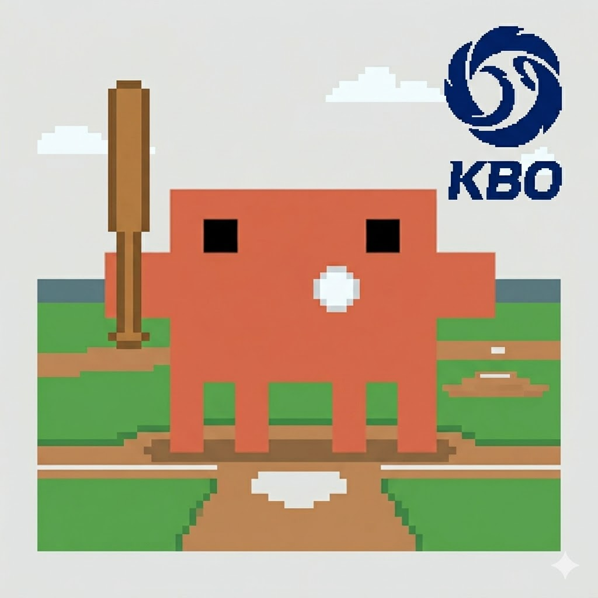

# claude-kbo-theme

<p align="right">
  <a href="README.md">English</a> · <b>한국어</b>
</p>

<p align="center">
  
</p>

KBO(한국프로야구) 팀 테마 for [Claude Code](https://docs.anthropic.com/en/docs/claude-code) — Clawd(Claude 마스코트)를 응원하는 팀의 색상, 모자, 로고로 꾸며보세요.

[](https://www.npmjs.com/package/claude-kbo-theme)
[](https://www.npmjs.com/package/claude-kbo-theme)
[](https://opensource.org/licenses/MIT)


## 기능

Claude Code 바이너리의 Clawd 캐릭터를 다음과 같이 변경:

- **팀 색상** — 몸통을 팀의 공식 색상으로 염색
- **야구 모자** — Clawd 머리 위에 픽셀 아트 팀 로고가 박힌 모자
- **눈 색상** — 어두운 바디에서도 자연스럽게 보이도록 조정

KBO 10개 팀 전부 지원.

## 지원 팀

<table>
  <tr>
    <td align="center"><br/><code>kia</code> KIA 타이거즈</td>
    <td align="center"><br/><code>samsung</code> 삼성 라이온즈</td>
  </tr>
  <tr>
    <td align="center"><br/><code>lg</code> LG 트윈스</td>
    <td align="center"><br/><code>doosan</code> 두산 베어스</td>
  </tr>
  <tr>
    <td align="center"><br/><code>kt</code> KT 위즈</td>
    <td align="center"><br/><code>ssg</code> SSG 랜더스</td>
  </tr>
  <tr>
    <td align="center"><br/><code>nc</code> NC 다이노스</td>
    <td align="center"><br/><code>lotte</code> 롯데 자이언츠</td>
  </tr>
  <tr>
    <td align="center"><br/><code>hanwha</code> 한화 이글스</td>
    <td align="center"><br/><code>kiwoom</code> 키움 히어로즈</td>
  </tr>
</table>

## 요구사항

Claude Code가 **네이티브 인스톨러**로 설치되어 있어야 합니다 — npm 설치 버전은 지원하지 않습니다.

이 도구는 네이티브 인스톨러가 설치하는 Bun 컴파일 Mach-O 바이너리를 패치합니다. 만약 시스템의 `claude`가 npm으로 설치된 쉘 스크립트(`npm install -g @anthropic-ai/claude-code`)라면 패치할 바이너리가 없어서 "Could not find Claude Code binary" 에러가 납니다.

확인 방법:

```bash
file "$(which claude)"
# 예상 결과: Mach-O 64-bit executable ...
# "a /usr/bin/env node script" 가 뜨면 npm 빌드입니다.
```

npm 빌드라면 네이티브 인스톨러로 재설치하거나 Claude Code 내부에서 `/migrate-installer` 명령을 실행한 뒤 이 도구를 사용하세요.

## 설치

```bash
npm install -g claude-kbo-theme
```

> 참고: `claude-kbo-theme` 자체는 npm으로 배포되지만, 패치 대상인 **Claude Code**는 네이티브 설치여야 합니다.

## 사용법

```bash
# 응원하는 팀 적용
claude-kbo kia

# 전체 팀 목록
claude-kbo --list

# 원래 Clawd로 복구
claude-kbo --restore

# 도움말
claude-kbo --help
```

적용 후에는 **Claude Code를 재시작**해야 변경사항이 보여요.

## 동작 원리

1. **탐색** — Claude Code 바이너리 위치 자동 감지 (`~/.local/bin/claude` 또는 `/usr/local/bin/claude`)
2. **추출** — Mach-O `__BUN.__bun` 섹션에서 번들된 JavaScript 추출
3. **패치** — Clawd 렌더링 코드 수정 (색상 문자열 교체, 모자 요소 삽입)
4. **재구성** — Bun 블롭 포맷으로 재조립 (StringPointer 오프셋 전부 재계산)
5. **세그먼트 확장** — 필요 시 Mach-O `__BUN` 세그먼트를 페이지 정렬(ARM64에서 16KB)에 맞춰 확장
6. **재서명** — 애드혹 서명으로 바이너리 재서명 (`codesign -s -`)

전체 바이너리 조작 로직이 순수 Node.js로 구현됨(약 500줄, 외부 의존성 0) — `node-lief`, `tweakcc` 등 불필요.

첫 실행 시 원본 바이너리는 `<binary>.backup`으로 자동 백업됨.

## 플랫폼 지원

- ✅ **macOS** (ARM64 및 x86_64) — Claude Code 네이티브 바이너리
- ⚠️ **Linux** — 미검증 (ELF 바이너리는 포맷이 달라 별도 구현 필요)
- ❌ **Windows** — 미지원

## 제한사항

- Claude Code 업데이트 시 패치된 바이너리가 덮어쓰기되므로, 업데이트 후 `claude-kbo <team>` 재실행 필요
- 첫 실행 시 백업은 당시 상태 그대로 저장됨. 이미 수정된 Claude Code라면 먼저 `--restore` 후 업데이트할 것
- 터미널 캐릭터 정렬은 블록 문자를 정확히 렌더링하는 고정폭 폰트에서 최적

## 라이선스

MIT
