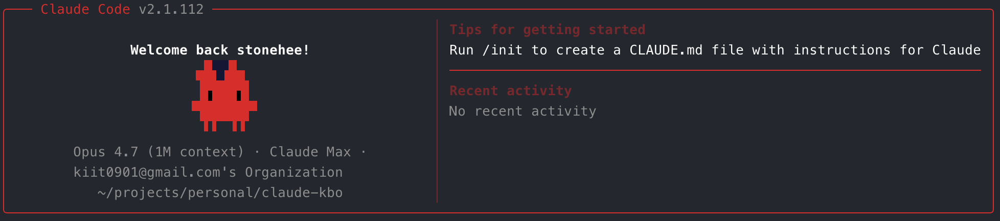
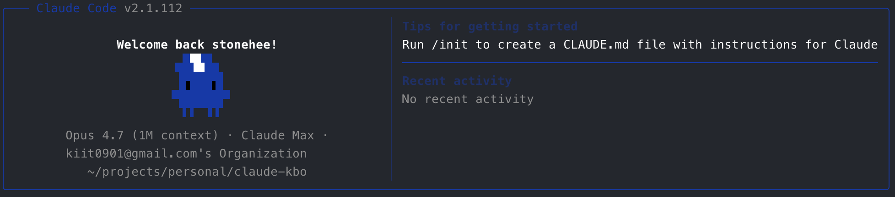
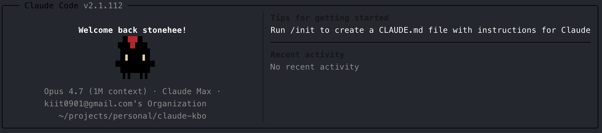
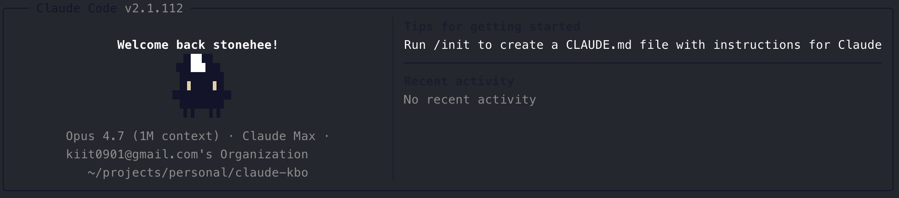
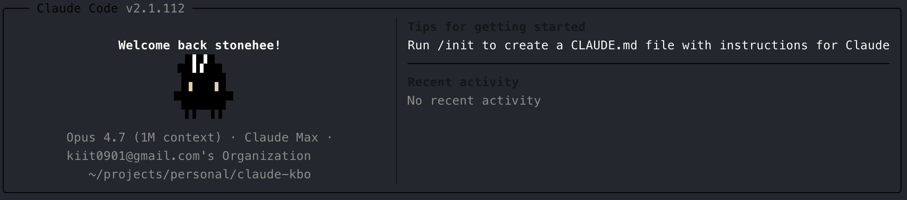
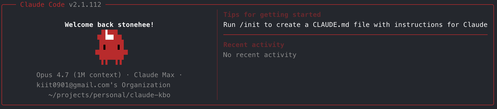
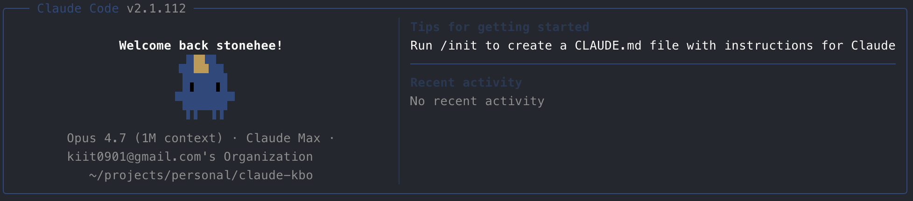
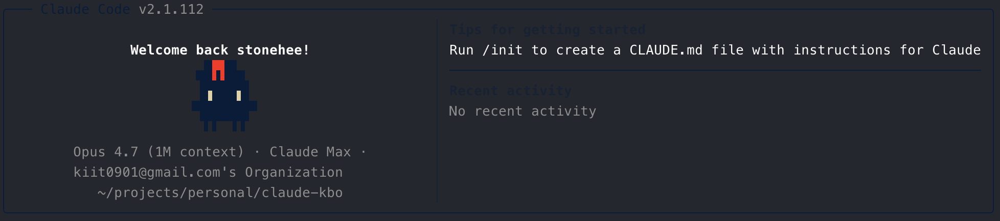
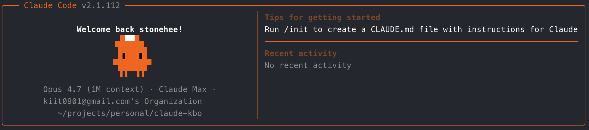
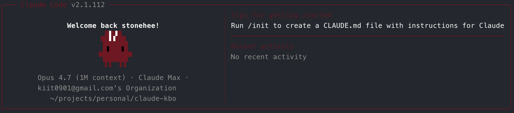

# claude-kbo-theme

<p align="right">
  <b>English</b> · <a href="README.ko.md">한국어</a>
</p>

KBO (Korean Baseball Organization) team theme for [Claude Code](https://docs.anthropic.com/en/docs/claude-code) — dress up Clawd (Claude's mascot) with your favorite team's colors, cap, and logo.


## What it does

Patches the Clawd character in your Claude Code binary with:

- **Team color** — body dyed in your team's official color
- **Baseball cap** — sitting on top of Clawd's head, with team logo in pixel art
- **Eye color** — adjusted for visibility on dark team bodies

All 10 KBO teams supported.

## Supported teams

<table>
  <tr>
    <td align="center"><br/><code>kia</code> KIA 타이거즈</td>
    <td align="center"><br/><code>samsung</code> 삼성 라이온즈</td>
  </tr>
  <tr>
    <td align="center"><br/><code>lg</code> LG 트윈스</td>
    <td align="center"><br/><code>doosan</code> 두산 베어스</td>
  </tr>
  <tr>
    <td align="center"><br/><code>kt</code> KT 위즈</td>
    <td align="center"><br/><code>ssg</code> SSG 랜더스</td>
  </tr>
  <tr>
    <td align="center"><br/><code>nc</code> NC 다이노스</td>
    <td align="center"><br/><code>lotte</code> 롯데 자이언츠</td>
  </tr>
  <tr>
    <td align="center"><br/><code>hanwha</code> 한화 이글스</td>
    <td align="center"><br/><code>kiwoom</code> 키움 히어로즈</td>
  </tr>
</table>

## Installation

```bash
npm install -g claude-kbo-theme
```

## Usage

```bash
# Apply your team
claude-kbo kia

# List all teams
claude-kbo --list

# Restore original Clawd
claude-kbo --restore

# Help
claude-kbo --help
```

After applying, **restart Claude Code** to see the change.

## How it works

On install, the tool:

1. **Finds** your Claude Code binary (`~/.local/bin/claude` or `/usr/local/bin/claude`)
2. **Extracts** the embedded JavaScript from the Mach-O `__BUN.__bun` section
3. **Patches** the Clawd rendering code (color strings, hat insertion)
4. **Rebuilds** the Bun blob with correct offsets and trailer
5. **Extends** the Mach-O segment with page-aligned growth (16KB on ARM64)
6. **Re-signs** the binary with an ad-hoc signature (`codesign -s -`)

The entire binary manipulation is implemented in pure Node.js (~500 lines, no external dependencies) — no `node-lief`, no `tweakcc`, no shell wizardry.

The original binary is backed up to `<binary>.backup` on first run.

## Platform support

- ✅ **macOS** (ARM64 and x86_64) — Claude Code native binary
- ⚠️ **Linux** — not tested (ELF binaries have a different format)
- ❌ **Windows** — not supported

## Limitations

- **Claude Code updates** overwrite the patched binary. Just run `claude-kbo <team>` again after updates.
- The backup is created from whatever was present on first run, so if Claude Code was already modified, run `--restore` before updating.
- Terminal alignment of the cap is pixel-perfect only for monospace fonts rendering block-drawing characters correctly.

## License

MIT
